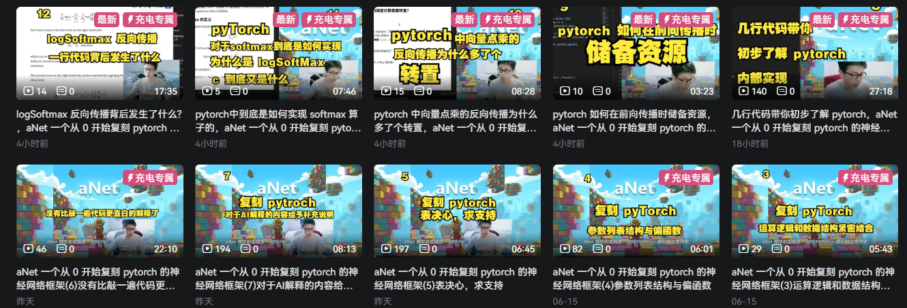

# aNet: 深入理解与实践深度学习框架


aNet 不仅仅是一个深度学习框架，还是一个专为**理解和实践现代深度学习框架核心原理**而设计的教学与研究项目。如果你曾好奇 PyTorch、TensorFlow 等主流框架是如何在底层运作的，那么 aNet 将是你的理想起点 🚀。

## 💡 为何选择 aNet？

aNet 的设计理念是小而美，旨在摆脱复杂性，让你直接触达深度学习的本质：

  * **PyTorch 风格的学习路径**：aNet 的 API 设计深受 PyTorch 启发，让你在学习 aNet 的同时，也能无缝过渡到理解 PyTorch 的运作机制和设计哲学。通过亲手实现和修改 aNet 的组件，你将对自动微分、计算图、张量操作等概念有更深刻的认识。

  * **轻量级与多语言接口**：相信深度学习不应被语言所限制。aNet 核心库追求极致的**轻量级**，易于理解和扩展。除了原生的 Python 接口，我们正积极开发对 **C/C++/Go/JavaScript** 等主流编程语言的绑定接口。这意味着你可以用你最熟悉的语言，探索和构建深度学习模型，拓宽你的技术栈。

  * **洞察 CPU/GPU 底层实现**：aNet 的一个核心目标是揭示深度学习运算在 **CPU 和 GPU 上的底层实现细节**。你将有机会深入学习张量运算是如何被优化、如何利用并行计算提升效率、以及内存管理在高性能计算中的关键作用。通过 aNet，你可以亲手调试和优化这些底层代码，真正理解“为什么快”和“如何更快”。

## ✨ 主要特性

  * **PyTorch 风格 API**：易于上手，快速理解主流框架范式。
  * **模块化设计**：核心组件清晰分离，方便学习和贡献。
  * **自动微分**：从零开始理解反向传播和梯度计算。
  * **优化器**：实现 SGD, Adam 等经典优化算法。
  * **GPU 支持**：探索 CUDA 编程，理解 GPU 加速原理。
  * **跨语言接口 (规划中)**：支持 Python, C/C++, Go, JavaScript。
  * **丰富文档与示例**：提供详细的文档和代码示例，助你快速入门。

## 🚀 快速开始

```bash
# 克隆仓库
git clone https://github.com/zidea/aNet.git
cd aNet

```

## 📚 学习路线

我们推荐你按照以下路径深入学习 aNet：

1.  **基础概念**：理解张量（Tensor）、计算图（Computation Graph）和自动微分（Autograd）。
2.  **核心模块**：学习如何实现线性层、激活函数、损失函数等基本组件。
3.  **优化器**：探索各种梯度下降算法的实现细节。
4.  **GPU 加速**：深入理解 CUDA 或 OpenCL 编程，将运算迁移到 GPU。
5.  **跨语言绑定**：尝试使用其他语言调用 aNet 核心库。


## ▶️ 相关视频(b站 zidea2015)
<div align="center">

</div>

[详细视频链接](https://space.bilibili.com/476895565)

**开始你的深度学习底层探索之旅吧！**


## 🤝 贡献

aNet 是一个开源项目，我们非常欢迎社区的贡献。无论是 Bug 报告、功能请求、代码改进还是文档撰写，你的每一次贡献都将帮助 aNet 变得更好。
